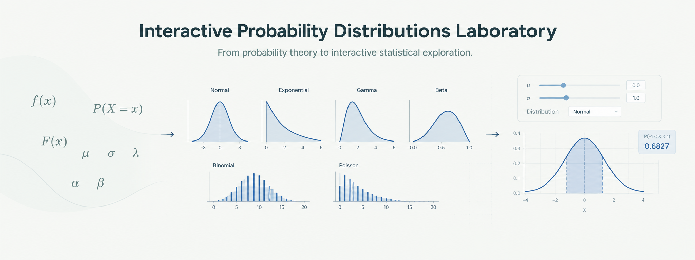
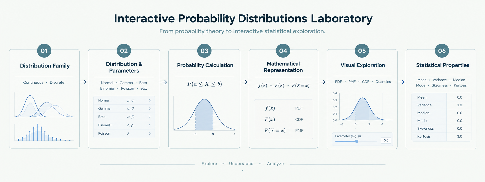

# Interactive Probability Distributions Laboratory

> **Project Signature**
> *From probability theory to interactive statistical exploration.*



## Project Overview

Probability distributions are fundamental to statistical modeling, yet they are often introduced through formulas and isolated numerical exercises.

This project transforms those concepts into an interactive **R Shiny** application where users can modify distribution parameters, calculate probabilities, inspect mathematical representations, explore distribution functions, and examine theoretical statistical properties in real time.

The laboratory supports both **continuous and discrete probability distributions**, with bilingual interaction in **Spanish and English**.

---

## Repository Identity

| Attribute | Description |
|---|---|
| **Discipline** | Statistical Computing & Probability |
| **Domain** | Probability Distributions |
| **Programming Language** | R |
| **Framework** | Shiny |
| **Visualization** | ggplot2 & Plotly |
| **Project Type** | Interactive Statistical Application |
| **Project Status** | Completed |
| **License** | MIT |

---

## Why This Project Matters

This project started from a simple teaching problem.

When I first learned probability distributions, discrete distributions were relatively easy to represent on paper or calculate manually. Continuous distributions were different. In class, they were usually represented by a static curve drawn on the board or shown on a screen, often with the same generic shape regardless of the distribution.

That made it difficult to develop an intuitive understanding of how different continuous distributions actually look and how their parameters change their shape.

During the pandemic, while learning R and later R Shiny, I had the opportunity to turn that idea into something interactive. The original purpose of this application was to give my students a way to explore probability distributions visually rather than only seeing formulas and numerical calculations.

I developed the application, improved it over time, and used it in some of my classes.

Although I am no longer teaching, I continued to see value in the idea. The current version is an opportunity to revisit that original project, improve its statistical and computational implementation, and finally bring it to a finished state.

For me, the value of this project is therefore not only in the technology behind it. It comes from the original question that motivated it:

> **What if students could actually see how a probability distribution changes, instead of only being told what its formula looks like?**

That question remains relevant beyond the classroom, and it is the reason this project is worth keeping and sharing.

---

## Objectives

The project was developed to:

- Explore continuous and discrete probability distributions interactively.
- Calculate probabilities over user-defined intervals.
- Visualize probability density, mass, and cumulative distribution functions.
- Display general and parameter-evaluated mathematical equations.
- Provide theoretical statistics for each distribution.
- Explore quantiles for continuous distributions.
- Inspect probability tables for discrete distributions.
- Provide bilingual interaction in Spanish and English.
- Incorporate domain validation and explicit handling of discrete bounds.

---

## Analytical Workflow



The application follows a structured path from distribution selection to statistical interpretation:

```text
Distribution Family
        ↓
Distribution & Parameters
        ↓
Probability Definition
        ↓
Mathematical Representation
        ↓
Distribution Visualization
        ↓
Statistical Properties
        ↓
Quantile / Probability Tables
```

---

## Probability Distributions

The laboratory covers **11 probability distributions** divided into two families.

### Continuous Distributions

| Distribution | Main Parameters |
|---|---|
| Normal | μ, σ |
| Student's t | ν |
| Chi-square | k |
| Exponential | λ |
| Gamma | α, β |
| Beta | α, β |

### Discrete Distributions

| Distribution | Main Parameters |
|---|---|
| Binomial | n, p |
| Poisson | λ |
| Geometric | p |
| Hypergeometric | N, K, n |
| Negative Binomial | r, p |

The application explicitly documents the random variable, support, mathematical formulation, and parameterization for each distribution. The Geometric and Negative Binomial distributions use the R convention based on the number of failures observed before achieving the required number of successes.

---

## Core Functionality

### Interactive Probability Calculator

Users define lower and upper bounds and obtain the corresponding probability immediately.

For continuous distributions, the selected interval is highlighted under the density curve.

For discrete distributions, probabilities are calculated over the corresponding integer support, with explicit feedback when entered bounds require adjustment.

### Distribution Visualization

The application provides:

- Probability Density Functions for continuous distributions.
- Probability Mass Functions for discrete distributions.
- Cumulative Distribution Functions for both families.
- Interactive Plotly tooltips for numerical inspection.
- Visual highlighting of the selected probability interval or value.

### Theoretical Statistics

For each distribution, the application reports relevant theoretical properties including:

- Mean
- Variance
- Standard Deviation
- Median
- Mode
- Skewness
- Excess Kurtosis

Undefined or non-unique properties are explicitly identified where appropriate.

### Mathematical Representation

Each distribution includes:

- General mathematical form.
- Equation evaluated using the selected parameters.
- Distribution support.
- Definition of the random variable.
- Parameterization notes where relevant.

This connects the mathematical definition with the numerical configuration used in the application.

### Tables

Continuous distributions provide a **quantile table** using selected cumulative probabilities from 0% to 100%.

Discrete distributions provide a **probability table** containing:

- `x`
- `P(X = x)`
- `F(x)`

---

## Bilingual Interface

The application supports runtime switching between:

- **Spanish**
- **English**

The language selection updates the main interface, distribution names, statistical labels, equations and explanatory definitions.

---

## Validation & Statistical Handling

The application includes explicit validation of probability inputs and distribution support.

Examples include:

- Lower bound must not exceed the upper bound.
- Continuous values must fall within the distribution domain.
- Discrete values must be compatible with the distribution support.
- Non-integer discrete bounds are explicitly adjusted rather than silently ignored.
- Distribution-specific support restrictions are considered for finite discrete distributions such as the Binomial and Hypergeometric distributions.

This validation is intended to make the application's behavior transparent rather than hiding computational adjustments from the user.

---

## Technical Implementation

The application is implemented as a single R Shiny application using:

- **R**
- **Shiny** for the interactive application framework
- **ggplot2** for statistical graphics
- **Plotly** for interactive visualization
- **dplyr** for data manipulation

The statistical calculations rely on R's probability distribution functions, including density/mass, cumulative distribution, and quantile functions.

The application uses reactive components to update parameters, calculations, equations, statistics, tables and visualizations as the user interacts with the interface.

---

## Repository Organization

```text
shiny-interactive-probability-lab/

├── R/
│   └── app.r
│
├── README.md
├── LICENSE
└── .gitignore
```

### Folder Purpose

| Path | Purpose |
|---|---|
| `R/app.r` | Complete R Shiny application |
| `README.md` | Project documentation |
| `LICENSE` | MIT License |
| `.gitignore` | Local and R-specific files excluded from version control |

The repository intentionally remains compact because the application does not depend on an external analytical dataset, a multi-script modeling workflow, or generated analytical outputs.

---

## Key Takeaways

- Probability distributions can be explored through a single interactive statistical environment.
- The application connects mathematical definitions with numerical probability calculations and visual representations.
- Continuous and discrete distributions require different probability and support handling, which is reflected explicitly in the application.
- Interactive visualization provides an immediate way to observe how distribution parameters affect probability behavior.
- The project demonstrates the translation of statistical theory into a functional **R Shiny** application.

---

## Skills Demonstrated

- Probability Theory
- Statistical Computing
- R Programming
- R Shiny Development
- Reactive Programming
- Statistical Visualization
- Interactive Data Visualization
- Mathematical Representation
- Statistical Communication
- Bilingual Interface Design

---

## Future Improvements

Possible extensions include:

- Adding simulation-based demonstrations for each distribution.
- Allowing users to compare multiple distributions simultaneously.
- Introducing empirical-data fitting against theoretical distributions.
- Extending the laboratory toward sampling distributions and statistical inference.

These are potential extensions rather than current project components.

---

## Academic & Professional Context

The application originated as an educational tool for teaching probability and statistics and was subsequently developed into a more structured interactive laboratory.

The project represents an intersection of:

**Statistical Theory · Computational Implementation · Interactive Visualization**

---

## License

This project is licensed under the **MIT License**. See the `LICENSE` file for details.

---

## Author

**Joffre E. Sánchez Cerón**

MSc Statistics and Data Science (Candidate)
Hasselt University

**Applied Statistics | Data Science | AI Solutions**
[LinkedIn](https://www.linkedin.com/in/joffre-sanchez) · [GitHub](https://github.com/Koffre)

---

*Transforming complex problems into structured, data-driven solutions.*
